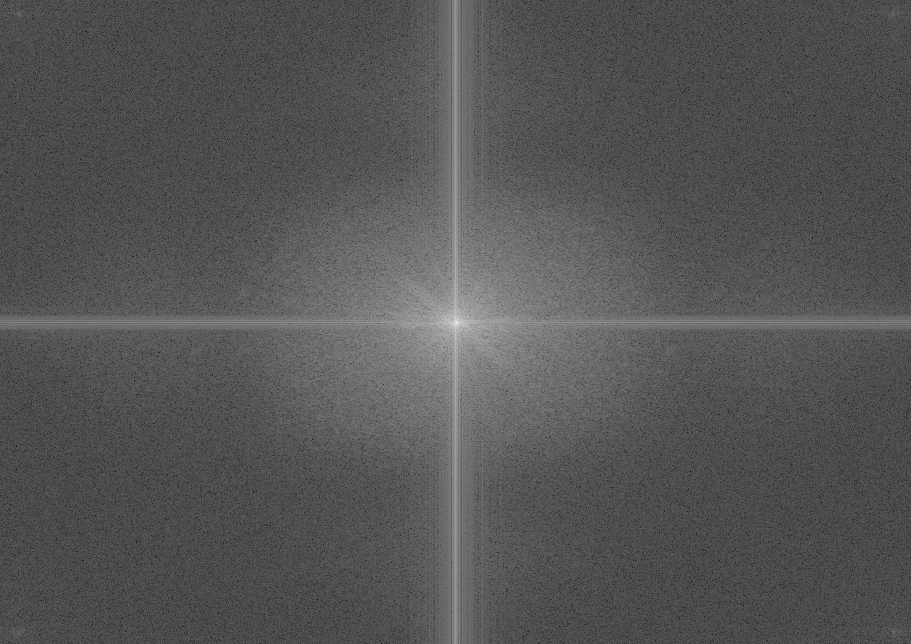
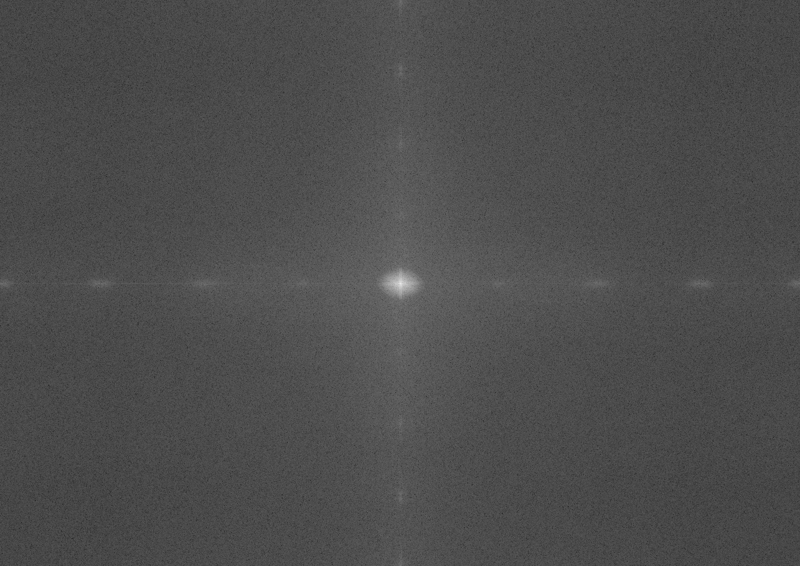

# Naive 2D DFT (CUDA)

Converts input images to the frequency graph.

## Pipeline

1. Read the input image from `images/input/`.
2. Convert it to grayscale and save the intermediate file in `images/intermediate/`.
3. Run `dft2d_kernel` to compute the complex spectrum F(u,v).
4. Compute magnitude, apply log scaling, and shift the spectrum center (DC to the middle).
5. Write the frequency graph to `images/output/` (PNG or PGM).

## Mathematical Background

For a discrete grayscale image $f(x,y)$ of size $M \times N$, the 2D discrete Fourier transform is:

```math
F(u,v) = \sum_{x=0}^{M-1} \sum_{y=0}^{N-1}
f(x,y)\,e^{-j 2\pi \left(\frac{ux}{M} + \frac{vy}{N}\right)}
```

Real and imaginary parts:

```math
\Re\{F(u,v)\} = \sum_{x=0}^{M-1}\sum_{y=0}^{N-1}
f(x,y)\cos\left(2\pi\left(\frac{ux}{M}+\frac{vy}{N}\right)\right)
```

```math
\Im\{F(u,v)\} = -\sum_{x=0}^{M-1}\sum_{y=0}^{N-1}
f(x,y)\sin\left(2\pi\left(\frac{ux}{M}+\frac{vy}{N}\right)\right)
```

Spectrum magnitude:

```math
|F(u,v)| = \sqrt{\Re\{F(u,v)\}^2 + \Im\{F(u,v)\}^2}
```

For visualization, the code applies log compression:

```math
S(u,v) = \log\left(1 + |F(u,v)|\right)
```

and normalizes to [0, 255] before writing the output image.

## Build and Run

```bash
make
./dft [input_path] [intermediate_pgm_path] [graph_output_path]
```

Example:

```bash
./dft images/input/image.png images/intermediate/png_input.pgm images/output/png_freq_graph.png
./dft images/input/image.jpg images/intermediate/jpg_input.pgm images/output/jpg_freq_graph.png
```

## Input vs Frequency Graph Comparison


|---|---|---|
| PNG |  |  | 
| JPG |  |  | 